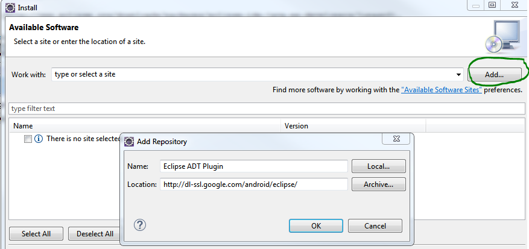

# Building SB10 for Android

## System prerequisites:
  * Install Eclipse for Java Developers. This was tested with the [Luna Service Release](http://www.eclipse.org/downloads/packages/eclipse-ide-java-ee-developers/lunasr2) of the Eclipse IDE for Java EE Developers.
  * Install SDK tools
      1. Download Windows command line tools package from https://developer.android.com/studio/index.html
      2. Extract the zip and place the tools folder in, for example, (C:\Users\username\android-sdks). This same location will be referenced in Eclipse in the following steps.
      3. On CMD run `cd C:\Users\username\android-sdks\tools\bin`. Using the SDK manager command line utility install the required Android build dependencies
      4. Install Android platform 5.0.1 (API21) `sdkmanager "platforms;android-21"`
      5. Install Build tools `sdkmanager "build-tools;22.0.1"`
      6. Install platform tools `sdkmanager "platform-tools"`
  * Install Eclipse ADT Plugin
      1. Open Eclipse IDE and choose Help > Install New Software…
      2. Click on Add..., Type **Eclipse ADT Plugin** for Name and http://dl-ssl.google.com/android/eclipse/ for Location and click **OK**.

		

      3. Select **Developer Tools** and click **next** to install. Agree to license and follow instructions.
      4. Restart Eclipse. Now your system is ready to build the Android Secure Browser.

 NOTE: If you prefer using the GUI to install Android tools, you can install Android studio which comes with Android SDK GUI manager.

## Build Process:
  * Check out the Android Mobile Browser source code from https://bitbucket.org/sbacoss/smarterapp-android/src
  * Import the Android Mobile Browser project into Eclipse
      1. Run Eclipse.
      2. Click **File** -> **Import…**, then choose “Existing Android Code into Workspace”, click **next**, and then specify the folder of the source code which you have checked out the source repository. The project will be imported to the Eclipse workspace.
  * Build the project. Choose the project in “Package Explorer”, and then Click **Project** -> **Build Project**. Make sure there are no compilation errors.
  * Export the project to an `apk` file. An apk file is the application file to install an application on any Android devices. To create an apk file, follow these steps:
      1. Right click the project, then choose **Export…**, in export destination, choose **Android**-> **Export** Android Application”
      2. Click **next** and then choose the project
      3. Next, you will be asked to specify keystore location (full path) and keystore password.
      4. You will then be asked to specify key alias, use the same keystore and password as in the previous step and add other certificate details.
      5. Specify the folder and the name of the apk file, and press “finish” to complete this procedure. An apk file should be created in the given path.